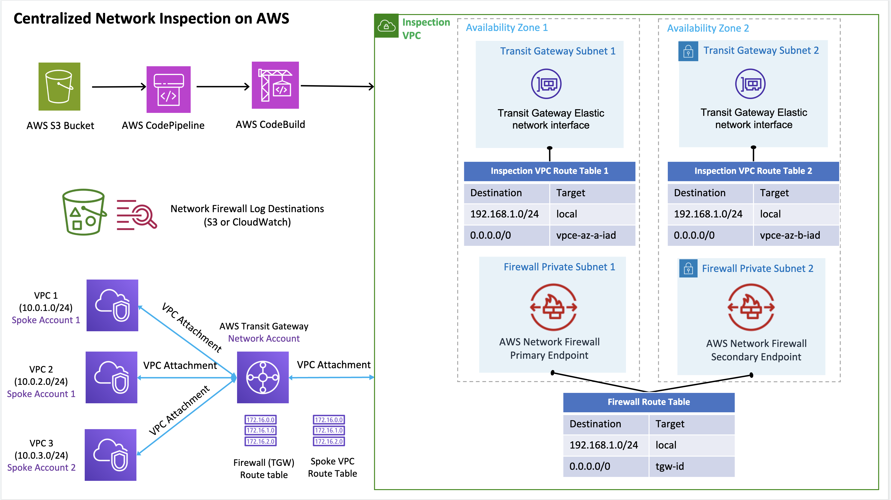

**[AWS Network Firewall Deployment Automations for AWS Transit Gateway](https://aws.amazon.com/solutions/implementations/aws-network-firewall-deployment-automations-for-aws-transit-gateway)** | **[🚧 Feature request](https://github.com/awslabs/aws-network-firewall-deployment-automations-for-aws-transit-gateway/issues/new?assignees=&labels=feature-request%2C+enhancement&template=feature_request.md&title=)** | **[🐛 Bug Report](https://github.com/awslabs/aws-network-firewall-deployment-automations-for-aws-transit-gateway/issues/new?assignees=&labels=bug%2C+triage&template=bug_report.md&title=)**

Note: If you want to use the solution without building from source, navigate to Solution Landing Page

## Table of contents

- [Solution Overview](#solution-overview)
- [Architecture Diagram](#architecture-diagram)
- [AWS CDK Constructs](#aws-solutions-constructs)
- [Customizing the Solution](#customizing-the-solution)
  - [Prerequisites for Customization](#prerequisites-for-customization)
  - [Build](#build)
  - [Unit Test](#unit-test)
  - [Deploy](#deploy)
- [File Structure](#file-structure)
- [License](#license)

<a name="solution-overview"></a>
# Solution Overview
Solution for AWS Network Firewall Deployment Automations for AWS Transit Gateway.

<a name="architecture-diagram"></a>
# Architecture Diagram


<a name="prerequisites-for-customization"></a>
## Prerequisites for Customization
* Node.js>12

<a name="build"></a>
## Build
Build the CDK code
```
cd source/
npm run build
```

Build the Network Firewall Solution CodeBuild source code
```
cd source/networkfirewallAutomation
tsc 
```

Build the templates for custom deployments

```
cd deployments/
chmod +x ./build-s3-dist.sh
./build-s3-dist.sh [SOLUTION_DIST_BUCKET] network-firewall-automation [VERSION_ID]
```

<a name="unit-test"></a>
## Unit Test
Run the unit tests 

```
cd source/
chmod +x ./run-all-tests.sh
```

<a name="deploy"></a>
## Deploy
Follow the steps for deploying your custom version of the solution.
* Create an S3 bucket with the bucket appended with the region in which the deployment is to be made. example, if the deployment is to be made in us-east-1 create a bucket name as [BUCKET_NAME]-us-east-1.
* Create the distribution files using the script provided in the build section above.
* Create the S3 Key in the bucket network-firewall-automation/[VERSION_ID]/
* Create the S3 Key in the bucket network-firewall-automation/latest/
* Copy the file ./deployment/regional-s3-assets/network-firewall-automation.zip to the location s3://[BUCKET_NAME]-[REGION]/network-firewall-automation/[VERSION_ID]/
* Copy the file ./deployment/regional-s3-assets/network-firewall-configuration.zip to the location s3://[BUCKET_NAME]-[REGION]/network-firewall-automation/latest/

Once the above steps are completed, use the file ./deployment/global-s3-assets/aws-network-firewall-deployment-automations-for-aws-transit-gateway.template to create a stack in CloudFormation.


<a name="file-structure"></a>
# File structure

aws-network-firewall-deployment-automations-for-aws-transit-gateway consists of:

- CDK constructs to generate necessary resources
- Microservices used in the solution

File Structure

<pre>
|-deployment/
  |build-s3-dist.sh/                     [ Build script for create the distribution for the solution.]
|-source/
  |-bin/
    |-network-firewall-auto-solution.ts  [ entry point for CDK app ]
  |-test/                  [ unit tests for CDK constructs ] 
    |-network-firewall-automation-solution.test.ts [CDK construct for the solution.]
    |-__snapshots__
      |-network-firewall-automation-solution.test.ts.snap [CDK construct template snapshot of unit testing.]
  |-lib/
    |-network-firewall-automation-solution-stack.ts [ CDK construct for the solution. ]
  |-networkFirewallAutomation
    |-__tests__
      |-firewall-test-configuration
        |-firewalls
          |-firewall-invalid.json
          |-firewall-nopolicy.json
          |-firewall-example.json
        |-firewallPolicies
          |-firewall-invalid-policy.json
          |-firewall-policy-2.json
          |-firewall-policy.example.json
        |-ruleGroups
          |-stateless-pass-action.example.json
          |-stateless-fwd-to-stateful.example.json
          |-stateful-domainblock.example.json
          |-drop.rules
          |-suricata-rule-reference.json
      |-network-firewall-service.spec.ts
      |-ec2-manager.spec.ts
      |-firewall-config-validation.spec.ts
      |-network-firewall-manager.spec.ts
      |-send-metrics.spec.ts
    |-config
      |-examples
        |-firewalls
          |-firewall.example.json
        |-firewallPolicies
          |-firewall-policy.example.json
        |-ruleGroups
          |-stateless-pass-action.example.json
          |-stateless-fwd-to-stateful.example.json
          |-stateful-domainblock.example.json
          |-drop.rules
          |-suricata-rule-reference.json
      |-firewallPolicies
        |-firewall-policy-1.json
      |-firewalls
        |-firewall-1.json
    |-lib
      |-ec2-manager.ts
      |-network-firewall-manager.ts
      |-common
        |-configReader
          |-config-reader.ts
        |-logger.ts
        |-stringUtils.ts
        |-firewall-config-validation.ts
        |-send-metrics.ts
      |-service
        |-awsClientConfig.ts
        |-ec2-service.ts
        |-network-firewall-service.ts
      |-build.ts
      |-index.ts
      |-config_files            [ tsconfig, jest.config.js, package.json etc. ]
  |-config_files                [ tsconfig, cdk.json, package.json etc. ]
  |-run-all-tests.sh
|-buildspec.yml
|-architecture.yml
|-CHANGELOG.md
|-CODE_OF_CONDUCT.md
|-LICENSE.txt
|-CONTRIBUTING.md
|-NOTICE.txt
</pre>

<a name="license"></a>


## Collection of operational metrics
This solution collects anonymous operational metrics to help AWS improve the quality and features of the solution. For more information, including how to disable this capability, please see the [implementation guide](https://docs.aws.amazon.com/solutions/latest/network-firewall-deployment-automations-for-aws-transit-gateway/collection-of-operational-metrics.html).


***

Copyright 2021 Amazon.com, Inc. or its affiliates. All Rights Reserved.

Licensed under the Apache License Version 2.0 (the "License"). You may not use this file except in compliance with the License. A copy of the License is located at

    http://www.apache.org/licenses/

or in the "license" file accompanying this file. This file is distributed on an "AS IS" BASIS, WITHOUT WARRANTIES OR CONDITIONS OF ANY KIND, express or implied. See the License for the specific language governing permissions and limitations under the License.

See [LICENSE](https://github.com/awslabs/aws-network-firewall-solution-for-aws-transit-gateway/blob/master/LICENSE.txt) 


